### Gaming-Schools-Pandas
#### <i> An analysis of Heroes of Pymoli and Py City Schools</i>

----------------------

**Description:**

I used Python and the Pandas Library to analyze purchase data for a game and student data for a school district.

<b>Datasets used:</b>

* [Purchase Data](HeroesofPymoli/Resources/purchase_data.csv)

* [School Data](PyCitySchools/Resources/schools_complete.csv)

* [Student Data](PyCitySchools/Resources/student_complete.csv)

### Tools used:
----------------------

  - Python
  - Pandas
  - Jupyter

### Analysis:
----------------------

### Heroes of Pymoli

#### Player Count

* Total Number of Players

#### Purchasing Analysis (Total)

* Number of Unique Items
* Average Purchase Price
* Total Number of Purchases
* Total Revenue

#### Gender Demographics

* Percentage and Count of Male Players
* Percentage and Count of Female Players
* Percentage and Count of Other / Non-Disclosed

#### Purchasing Analysis (Gender)

* The below each broken by gender
  * Purchase Count
  * Average Purchase Price
  * Total Purchase Value
  * Average Purchase Total per Person by Gender

#### Age Demographics

* Percentage and Count of ages <10
* Percentage and Count of ages 10-14
* Percentage and Count of ages 15-19
* Percentage and Count of ages 20-24
* Percentage and Count of ages 25-29
* Percentage and Count of ages 30-34
* Percentage and Count of ages 45-39
* Percentage and Count of ages >40

#### Purchasing Analysis (Age)

* The below each broken into bins of 4 years (i.e. &lt;10, 10-14, 15-19, etc.)
  * Purchase Count
  * Average Purchase Price
  * Total Purchase Value
  * Average Purchase Total per Person by Age Group

#### Top Spenders

* Top 5 spenders in the game by total purchase value. Table includes:
  * SN
  * Purchase Count
  * Average Purchase Price
  * Total Purchase Value

#### Most Popular Items

* 5 most popular items by purchase count. Table includes:
  * Item ID
  * Item Name
  * Purchase Count
  * Item Price
  * Total Purchase Value

#### Most Profitable Items

* 5 most profitable items by total purchase value. Table includes:
  * Item ID
  * Item Name
  * Purchase Count
  * Item Price
  * Total Purchase Value

### PyCitySchools

#### District Summary

* High level snapshot of the district's key metrics. Table includes:
  * Total Schools
  * Total Students
  * Total Budget
  * Average Math Score
  * Average Reading Score
  * % Passing Math (The percentage of students that passed math.)
  * % Passing Reading (The percentage of students that passed reading.)
  * % Overall Passing (The percentage of students that passed math **and** reading.)

#### School Summary

* Overview table that summarizes key metrics about each school. Table includes:
  * School Name
  * School Type
  * Total Students
  * Total School Budget
  * Per Student Budget
  * Average Math Score
  * Average Reading Score
  * % Passing Math (The percentage of students that passed math.)
  * % Passing Reading (The percentage of students that passed reading.)
  * % Overall Passing (The percentage of students that passed math **and** reading.)

#### Top Performing Schools (By % Overall Passing)

* Top 5 performing schools based on % Overall Passing. Table includes:
  * School Name
  * School Type
  * Total Students
  * Total School Budget
  * Per Student Budget
  * Average Math Score
  * Average Reading Score
  * % Passing Math (The percentage of students that passed math.)
  * % Passing Reading (The percentage of students that passed reading.)
  * % Overall Passing (The percentage of students that passed math **and** reading.)

#### Bottom Performing Schools (By % Overall Passing)

* Bottom 5 performing schools based on % Overall Passing. Table includes:
  * School Name
  * School Type
  * Total Students
  * Total School Budget
  * Per Student Budget
  * Average Math Score
  * Average Reading Score
  * % Passing Math (The percentage of students that passed math.)
  * % Passing Reading (The percentage of students that passed reading.)
  * % Overall Passing (The percentage of students that passed math **and** reading.)

#### Math Scores by Grade

* Average Math Score for students of each grade level (9th, 10th, 11th, 12th) at each school.

#### Reading Scores by Grade

* Average Reading Score for students of each grade level (9th, 10th, 11th, 12th) at each school.

#### Scores by School Spending

* Average Math Score
* Average Reading Score
* % Passing Math (The percentage of students that passed math.)
* % Passing Reading (The percentage of students that passed reading.)
* % Overall Passing (The percentage of students that passed math **and** reading.)

#### Scores by School Size

* Average Math Score
* Average Reading Score
* % Passing Math (The percentage of students that passed math.)
* % Passing Reading (The percentage of students that passed reading.)
* % Overall Passing (The percentage of students that passed math **and** reading.)

#### Scores by School Type

* Average Math Score
* Average Reading Score
* % Passing Math (The percentage of students that passed math.)
* % Passing Reading (The percentage of students that passed reading.)
* % Overall Passing (The percentage of students that passed math **and** reading.)

###  Data Visualization:
----------------------
### Heroes of Pymoli

#### Player Count
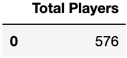

#### Purchasing Analysis (Total)
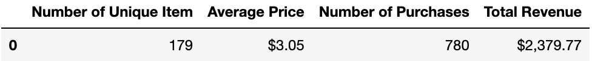

#### Gender Demographics
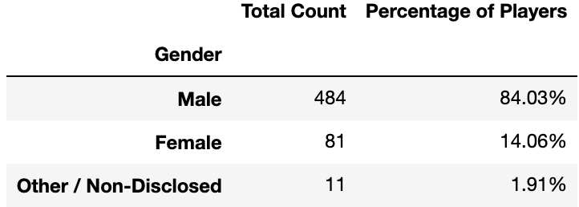

#### Purchasing Analysis (Gender)
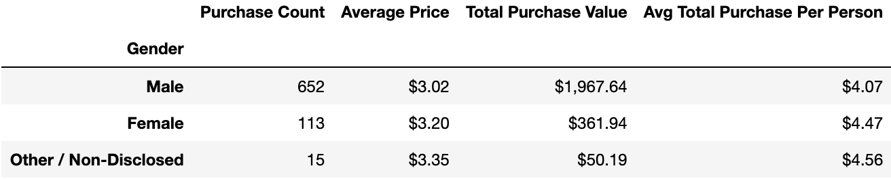

#### Age Demographics
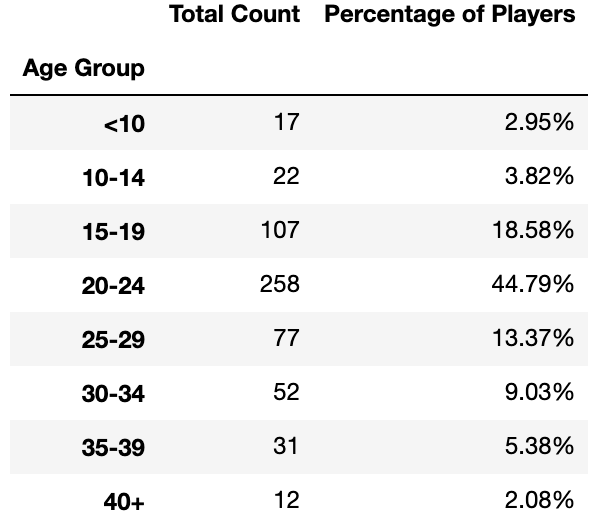

#### Purchasing Analysis (Age)
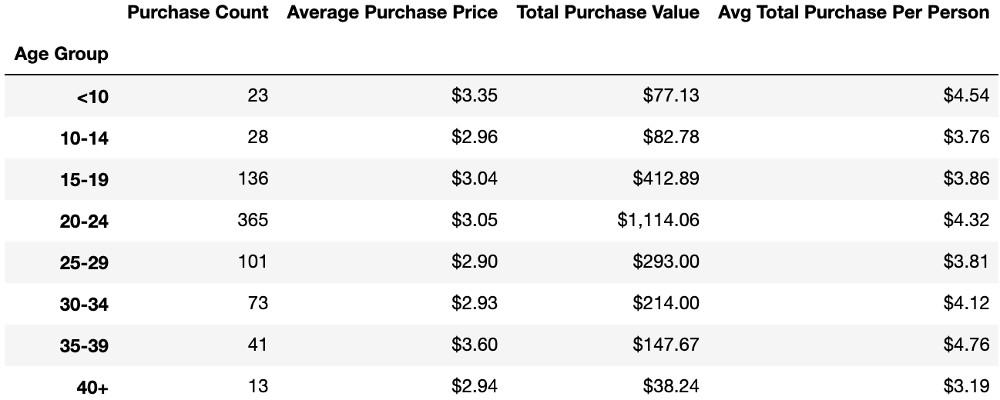

#### Top Spenders
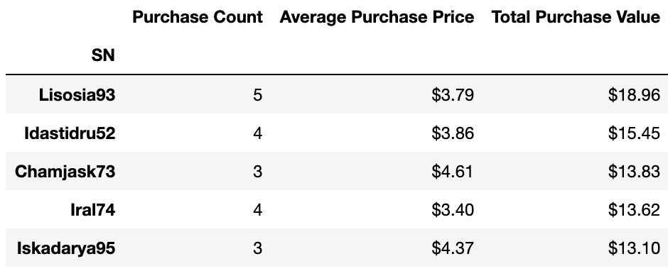

#### Most Popular Items
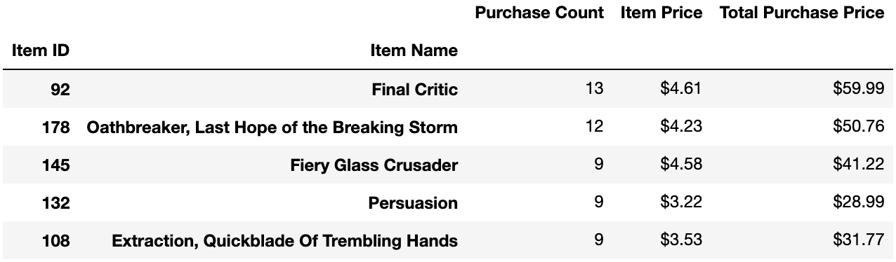

#### Most Profitable Items
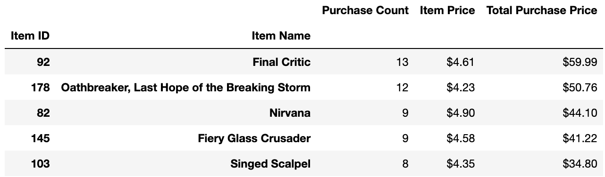

### PyCitySchools

#### District Summary
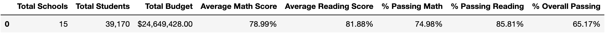

#### School Summary
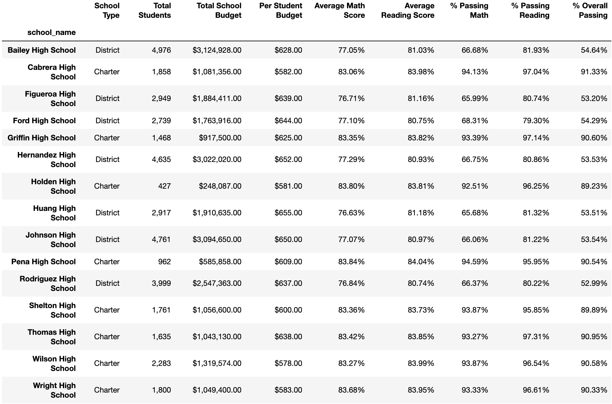

#### Top Performing Schools (By % Overall Passing)
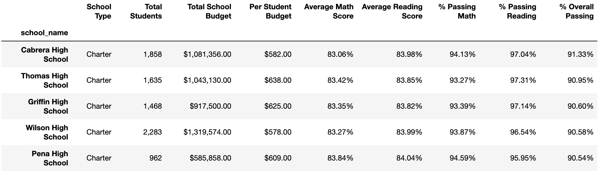

#### Bottom Performing Schools (By % Overall Passing)
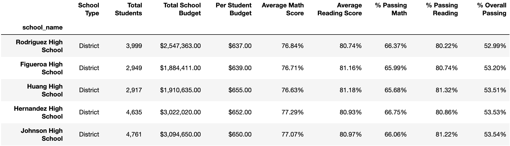

#### Math Scores by Grade
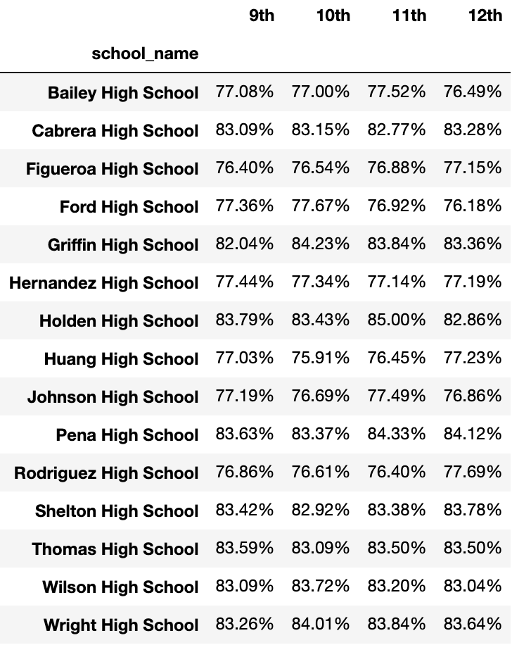

#### Reading Scores by Grade
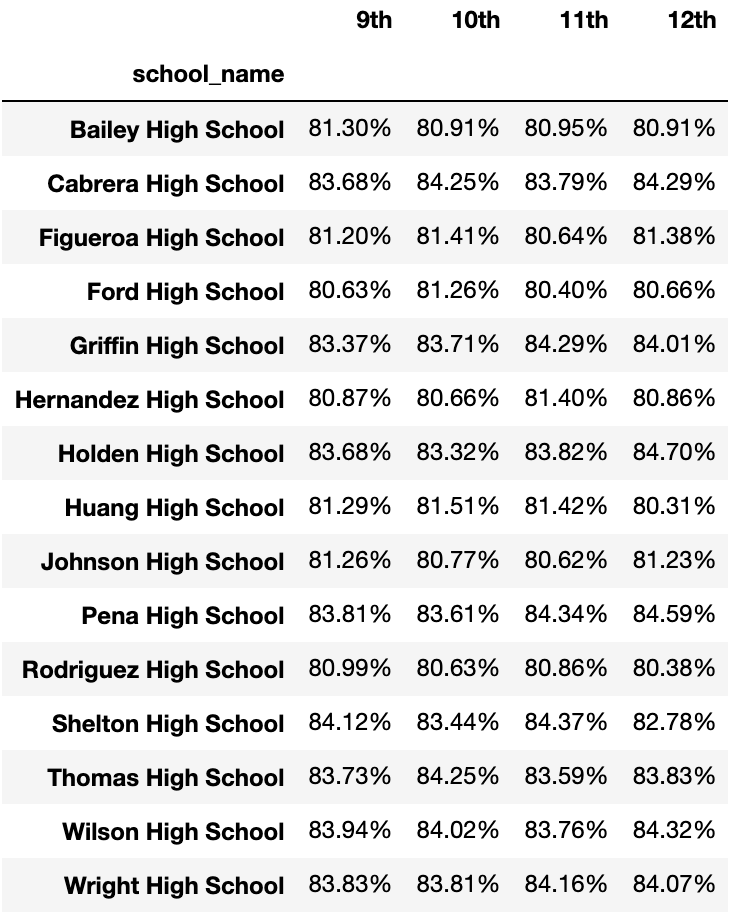

#### Scores by School Spending
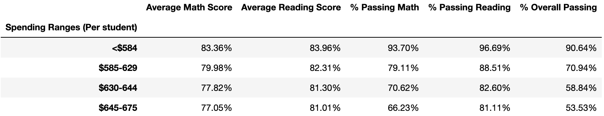

#### Scores by School Size
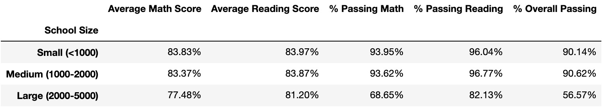

#### Scores by School Type
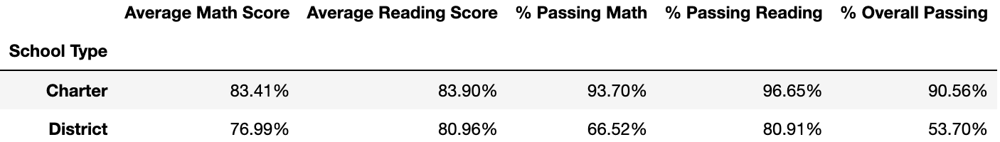